# 📄 Informe de Validación  

## Proyecto Modulo 3: Sistema de Gestión de Productos en Python 🐍

## 1. Introducción

El presente informe tiene como objetivo documentar el proceso de validación del **Sistema de Gestión de Productos**, desarrollado en lenguaje Python como parte del proyecto del módulo 3.  
El sistema permite administrar productos mediante una interfaz por consola, utilizando estructuras de datos como listas, diccionarios y sets, cumpliendo con los requisitos planteados en la consigna.

---

## 2. Entorno de pruebas

Las pruebas del sistema fueron realizadas en el siguiente entorno:

- **Sistema operativo:** Windows 10  
- **Lenguaje:** Python 3.13  
- **Editor de código:** Visual Studio Code  
- **Ejecución:** Consola (Terminal)  
- **Dependencias externas:** No utiliza librerías externas

---

## 3. Casos de prueba realizados

### 3.1 Inicio del sistema

**Descripción:**  
Se ejecuta el archivo principal del sistema para verificar el correcto despliegue del menú.

**Entrada:**  
- Ejecución del archivo `main.py`

**Resultado esperado:**  
- El sistema muestra el menú principal sin errores.

**Resultado obtenido:**  
- El menú principal se muestra correctamente.

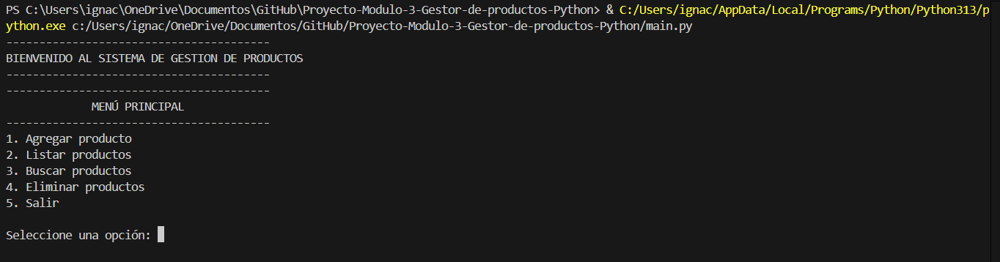

---

### 3.2 Agregar producto

**Descripción:**  
Se agrega un producto ingresando todos los datos solicitados por el sistema.

**Entrada:**    
- Nombre: Notebook Asus  
- Precio: 300000
- Stock: 3  
- Categoría: 1  

**Resultado esperado:**  
- El producto se agrega correctamente a la lista.

**Resultado obtenido:**  
- El sistema confirma que el producto fue agregado correctamente.

### Evidencia gráfica – Registro de productos

<table>
  <tr>
    <th colspan="2">Categoría: Computación</th>
  </tr>
  <tr>
    <td>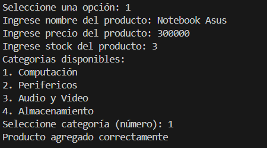</td>
    <td>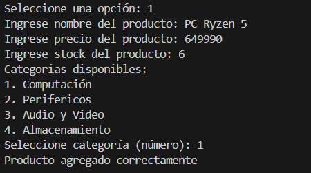</td>
  </tr>

  <tr>
    <th colspan="2">Categoría: Periféricos</th>
  </tr>
  <tr>
    <td>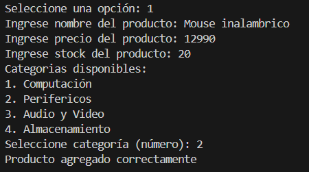</td>
    <td>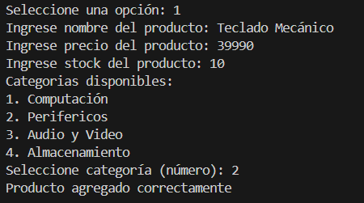</td>
  </tr>

  <tr>
    <th colspan="2">Categoría: Audio y Video</th>
  </tr>
  <tr>
    <td>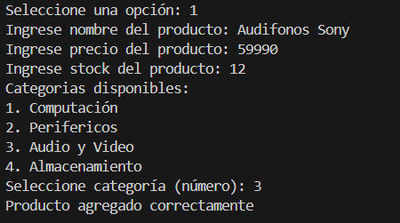</td>
    <td>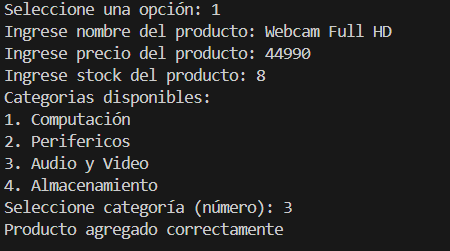</td>
  </tr>

  <tr>
    <th colspan="2">Categoría: Almacenamiento</th>
  </tr>
  <tr>
    <td>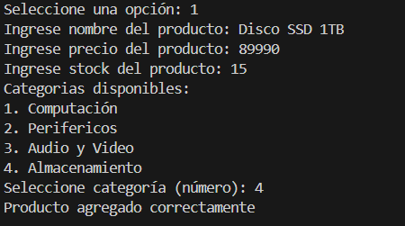</td>
    <td>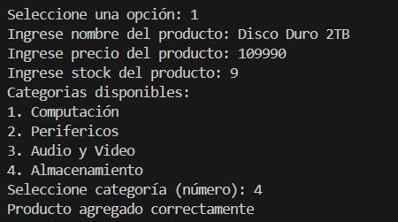</td>
  </tr>
</table>

---

### 3.3 Listar productos

**Descripción:**  
Se listan todos los productos almacenados en el sistema.

**Entrada:**  
- Selección de la opción “Listar productos”

**Resultado esperado:**  
- El sistema muestra todos los productos registrados con sus atributos.

**Resultado obtenido:**  
- Los productos se muestran correctamente en consola.

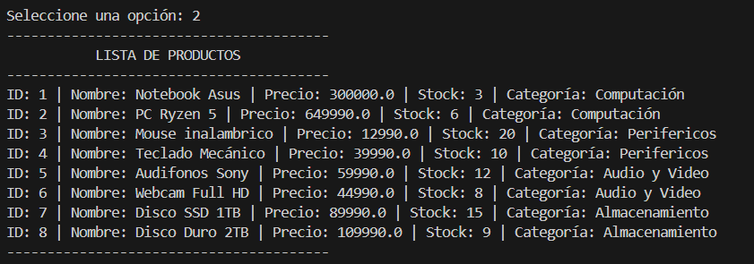

---

### 3.4 Buscar producto por ID

**Descripción:**  
Se busca un producto existente utilizando su ID.

**Entrada:**  
- ID del producto: 5

**Resultado esperado:**  
- El sistema encuentra el producto y muestra su información.

**Resultado obtenido:**  
- El producto es encontrado y sus datos se muestran correctamente.

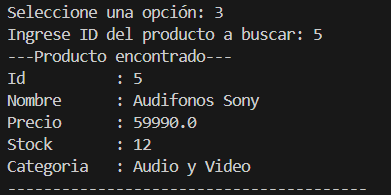

---

### 3.5 Eliminar producto

**Descripción:**  
Se elimina un producto registrado en el sistema mediante su ID.

**Entrada:**  
- ID del producto a eliminar: 2 y 6

**Resultado esperado:**  
- Los productos son eliminados del sistema.

**Resultado obtenido:**  
- El sistema confirma que los productos fueron eliminados correctamente.

<table>
  <tr>
    <th style="text-align: center;">Eliminación producto 2</th>
    <th style="text-align: center;">Eliminación producto 6</th>
  </tr>
  <tr>
    <td>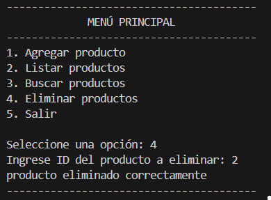</td>
    <td>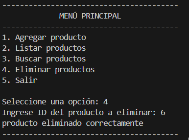</td>
  </tr>
</table>

- La lista figura sin los 2 productos eliminados.

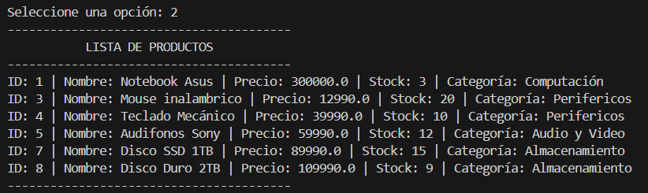

---

### 3.6 Eliminación de producto inexistente

**Descripción:**  
Se intenta eliminar un producto con un ID que no existe en el sistema.

**Entrada:**  
- ID inexistente

**Resultado esperado:**  
- El sistema indica que el producto no fue encontrado.

**Resultado obtenido:**  
- El sistema muestra un mensaje indicando que el producto no existe.

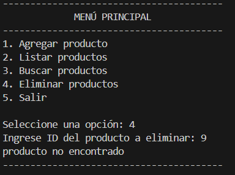

---

### 3.7 Creación de productos nuevos ya habiendo eliminado productos

**Descripción:**  
Se agrega un nuevo producto ya habiendo eliminado un producto previamente.

**Entrada:**  
- Nombre: Macbook  
- Precio: 699990
- Stock: 1
- Categoría: 1  

**Resultado esperado:**  
- El sistema asigna un nuevo ID válido al producto agregado, manteniendo la secuencia de IDs y evitando duplicados.

**Resultado obtenido:**  
- El sistema crea el producto asignándole el ID 9, correspondiente al siguiente valor disponible.

**Nota técnica:**
- El sistema mantiene un contador independiente de los IDs eliminados, asegurando la unicidad de los identificadores y la consistencia del sistema, incluso cuando se eliminan productos y se agregan nuevos posteriormente.

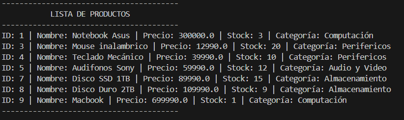

---

### 3.8 Búsqueda de producto eliminado

**Descripción:**  
Se intenta buscar un producto previamente eliminado.

**Entrada:**  
- ID del producto eliminado

**Resultado esperado:**  
- El sistema indica que el producto no fue encontrado.

**Resultado obtenido:**  
- El sistema confirma que el producto no existe.

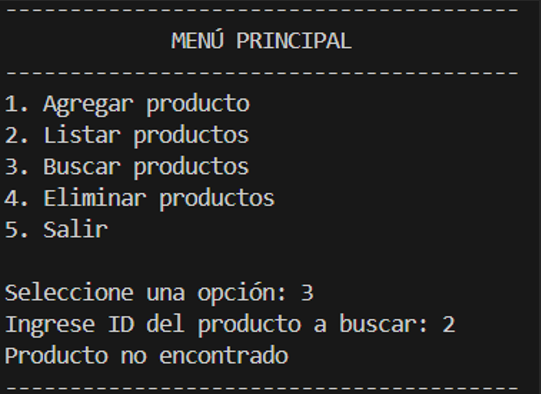

---
## 4. Video demostrativo 

🔗 **[Ver Video: Demostración del Sistema de Gestión](https://drive.google.com/file/d/1LDJKWoodPjEOy4nFf1gZi8h5ihNls9ym/view?usp=sharing)**

---

## 5. Análisis de resultados

Los resultados obtenidos durante el proceso de validación demuestran que el sistema funciona correctamente y cumple con los requerimientos definidos.  
Las validaciones implementadas permiten evitar errores comunes, como IDs duplicados o búsquedas inválidas, asegurando la integridad de la información.

---

## 6. Conclusión

El **Sistema de Gestión de Productos en Python** cumple satisfactoriamente con los objetivos propuestos y con las exigencias académicas del proyecto.  
El uso de estructuras de datos adecuadas y una organización modular del código permiten que el sistema sea fácil de entender, mantener y ampliar en el futuro.
